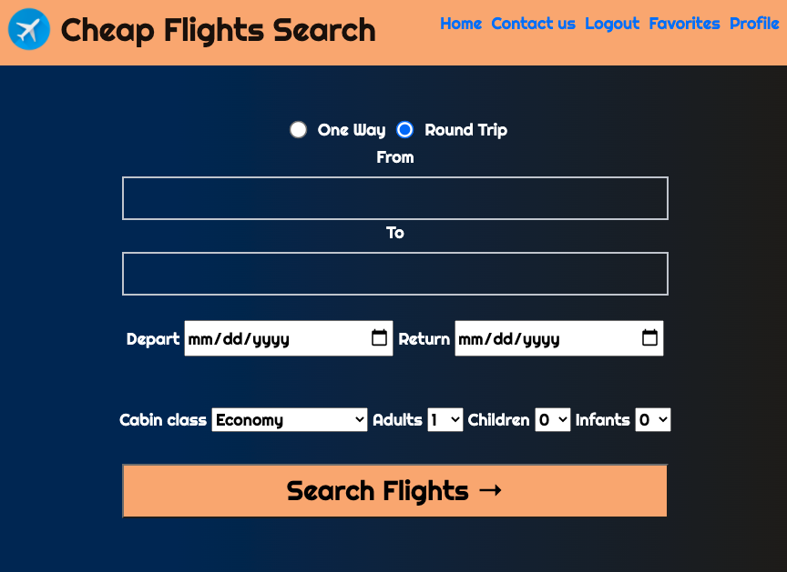
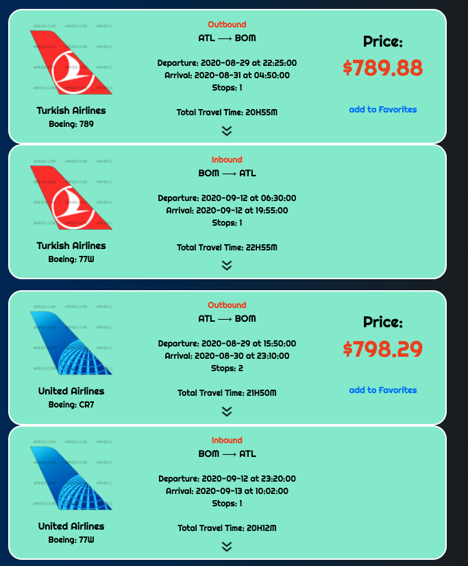

# CHEAP FLIGHT SEARCH

[Deployed Link](https://cheap-flight-search.herokuapp.com/)

This is my project 2 for building a full stack application. 

## Application Overview: 

* Search Page:
     
    

* Search Results (Examples):
     
    

## Applications Used:
* `JavaScript Vanila`
* `node modules`
* `CSS`
* `VS Code`
* `Heroku for Deploying it on the internet`

## Node Modules Used for building this application:
* `chai`
* `mocha`
* `supertest`
* `axios`
* `bcrypt`
* `connect-flash`
* `connect-session-sequelize`
* `dotenv`
* `ejs`
* `express`
* `express-ejs-layouts`
* `express-session`
* `method-override`
* `morgan`
* `passport`
* `passport-local`
* `pg`
* `sequelize`
* `airport-autocomplete-js`
* `sequelize-cli`
* `emailjs-com --save`

## API Used:
* [amadeus](https://developers.amadeus.com/self-service/apis-docs)
* [airlabs](http://airlabs.co/#/get_started)
* [EmailJs](https://www.emailjs.com/docs/)

## Routes:

| Method | Path | Location | Purpose |
| ------ | ---------------- | -------------- | ------------------- |
| GET | / | server.js | Home page/SearchPage |
| GET | /search | search.js | Search Result Page |
| GET | /favorites | favorites.js | Favorite Page |
| POST | /favorites/id/add | favorites.js | Add itinaries to Favorite |
| DELETE | /favorites/delete/id | favorites.js | Delete itinaries from Favorite |
| GET | /auth/login | auth.js | Login form |
| GET | /auth/signup | auth.js | Signup form |
| POST | /auth/login | auth.js | Login user |
| POST | /auth/signup | auth.js | Creates User |
| GET | /auth/logout | auth.js | Removes session info |
| GET | /profile | server.js | Regular User Profile |
| PUT | /profile/changePassword | server.js | to change user Password |
| GET | /contact | server.js | contact Page |
| GET | /error | server.js | Error Page |

 
 

## ERD:
 

 
 

## Steps to use in local machine

1. [Click here](https://github.com/subrataroy321/project_2_flight_search_app) to `Fork` and `Clone` the repo into local machine. 
2. [Click Here](https://www.postgresql.org/download/) to Download and Install PostgresSQL.
3. open iTerm or Terminal and cd into the cloned repo.
4. Install node modules from the package.json. Simply run `npm install` or `npm i` on iTerm/Terminal.
5. Create a local database for this project. Use this `sequelize db:create` command to create a database.
6. `sequelize model:create` use this sequelize command to create a model.
7. Run `sequelize db:migrate` to migrate the model into database. 
8. Add a .env file with the following fields:
* SESSION_SECRET: Can be any random string; usually a hash in production
* API_KEY: get an api key from [amadeus](https://developers.amadeus.com/self-service/apis-docs)
* API_SECRET: get an api secret from [amadeus](https://developers.amadeus.com/self-service/apis-docs)
* AIR_LAB_API_KEY: get an api key from [airlabs](http://airlabs.co/#/get_started)
* EMAILJS_USER_ID: get an user id from [EmailJs](https://www.emailjs.com/docs/)
9. Run server using following commands.
`nodemon`
or
`node index.js`
10. on your browser open `http://localhost:3000` to use the application.
    

## Thanks to owner and developer for the 404 Error Page 
[Codepen Link](https://codepen.io/subrataroy/pen/Vwajbpe)

## Special Thanks to all IA's and TA's.

## Author:

Subrata Roy  
@ General Assembly Student 
Connect [github](https://github.com/subrataroy321) - [linkedIn](https://www.linkedin.com/in/subrataroy321/)

