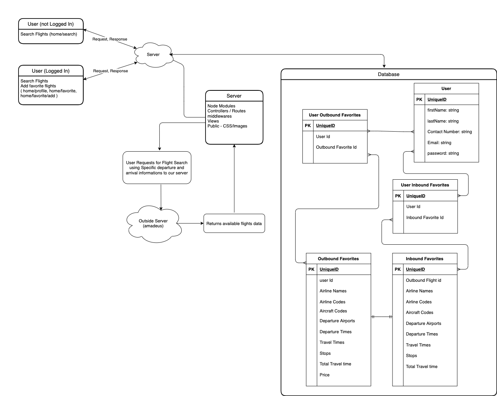

# CHEAP FLIGHT SEARCH

[Deployed Link](https://cheap-flight-search.herokuapp.com/)

This is my project 2 for building a full stack application. 

## ERD:

## Node Modules Used for building this application:
* `chai`
* `mocha`
* `supertest`
* `axios`
* `bcrypt`
* `connect-flash`
* `connect-session-sequelize`
* `dotenv`
* `ejs`
* `express`
* `express-ejs-layouts`
* `express-session`
* `method-override`
* `morgan`
* `passport`
* `passport-local`
* `pg`
* `sequelize`
* `airport-autocomplete-js`
* `sequelize-cli`

## Steps to use in local machine

1. [Click here](https://github.com/subrataroy321/project_2_flight_search_app) to `Fork` and `Clone` the repo into local machine. 
2. [Click Here](https://www.postgresql.org/download/) to Download and Install PostgresSQL.
3. open iTerm or Terminal and cd into the cloned repo.
4. Install node modules from the package.json. Simply run `npm install` or `npm i` on iTerm/Terminal.
5. Create a local database for this project. Use this `sequelize db:create` command to create a database.
6. `sequelize model:create` use this sequelize command to create a model.
7. Run `sequelize db:migrate` to migrate the model into database. 
8. Add a .env file with the following fields:
* SESSION_SECRET: Can be any random string; usually a hash in production
* API_KEY: get an api key from [amadeus](https://developers.amadeus.com/)
* API_SECRET: get an api secret from [amadeus](https://developers.amadeus.com/)
* AIR_LAB_API_KEY: get an api key from [airlabs](http://airlabs.co/#/get_started)
* EMAILJS_USER_ID: get an user id from [EmailJs](https://www.emailjs.com/docs/)
9. Run server using following commands.
`nodemon`
or
`node index.js`
10. on your browser open `http://localhost:3000` to use the application.
    
